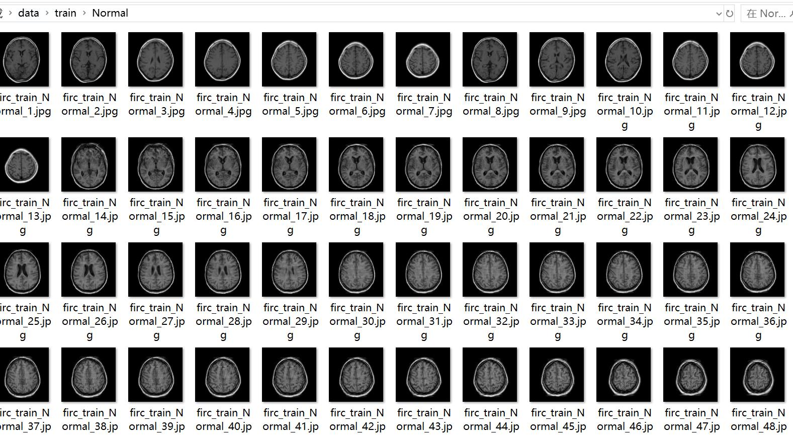
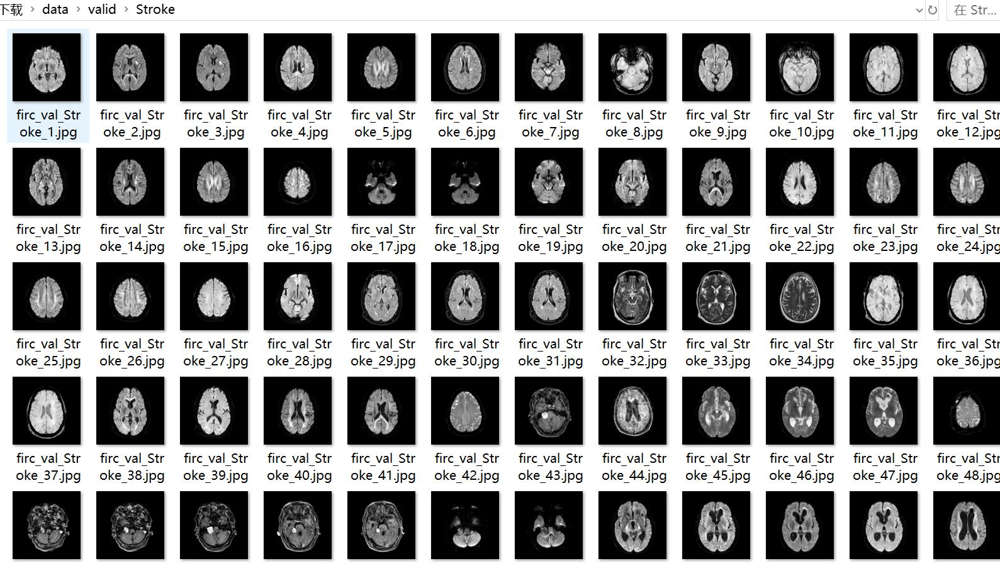

# Wisdom Medical Magnetic Resonance Imaging Brain Infarction Image Classification Dataset: 1884 Images in 2 Categories

Dataset Type: Image classification for use, not suitable for target detection with no labeled files.
Dataset Format: Only contains JPG images, each category folder contains corresponding images.
Number of Images (JPG File Count): 1887
Number of Categories: 2
Category Names: ['Normal', 'Stroke']
Number of Images per Category:
Training set images count: 1322
- Normal training set images count: 173
- Stroke training set images count: 1149
Validation set images count: 384
- Normal validation set images count: 43
- Stroke validation set images count: 341
Test set images count: 181
- Normal test set images count: 32
- Stroke test set images count: 149
Total Images Count:
- Normal total images count: 248
- Stroke total images count: 1639
Important Notes: None
Special Statement: This dataset does not guarantee the accuracy of the trained models or weight files.
Image Preview:

## Images

Here is a pay link on Stripe ( https://buy.stripe.com/3cs8yP7sY87d0vu9AB ). Please contact me lonlonago@foxmail.com after funding $89, and I will send you a complete data files , thank you!

